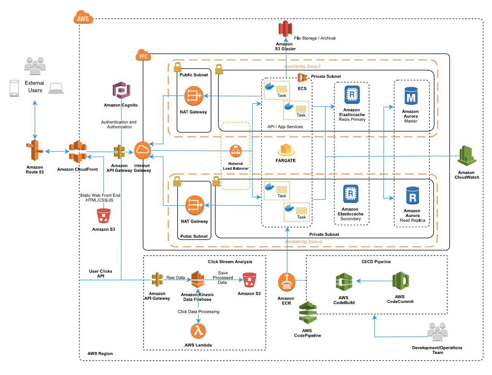

# CommBiz App Tier - Cloud Migration High Level Solution Architecture

## Solution Diagram

## Solution Summary
CommBiz is CBA’s online banking channel for Business clients (from small business to corporate and institutional customers) needing to deal with receivables, payment, and transfer functionality, to process large numbers of transactions or wanting to process high value transfers, payroll and accounts payable transactions. CommBiz is used as the primary business channel for the provision of other business banking products. CommBiz allows customers to manage access to their service, set fine grained access controls for accessing and operating accounts as well as inbuilt audit facilities.
