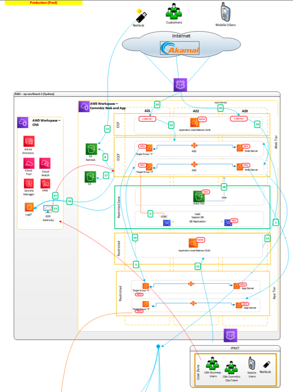

# CommBiz App Tier - Cloud Migration High Level Solution Architecture

## Solution Diagram

## Solution Summary
Current CommBiz application is large monolithic and configured for fixed/static capacity in CBA Data centers, Burwood and Norwest. It has reliability issues such as increased blast radius due to the tightly coupled architecture, where an issue in one component could take down the entire system. Simply moving them to the cloud will not magically endow them with all the dynamic features of the cloud.

Path to Cloud will be in incremental phases, Replatform and Cloud Native.
Replatforming- Target state architecture phase 1 and operations are supposed to be the same or similar to those that existed before, only replatformed to the cloud. As a result, IBB will achieve the significant benefits of EOL/EOS physical server migration to the cloud: remediate current EOS risks, savings on hosting and datacenter costs, as well as greater efficiency and scalability.

To deliver the outcome, phase 1 will build following core capabilities in the CommBiz Cloud platform,
- Fully Continuous Integration and Continuous Deployment (CI/CD) enabled (leverage CommSec) strategic technology stack upon which the IBB Hosting Platform is built
- Develop new skills and processes for CI/CD and software development to take advantage of cloud services and the agility promised by cloud computing.